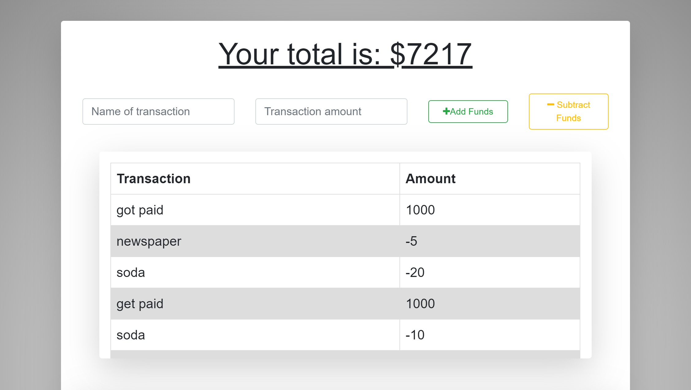
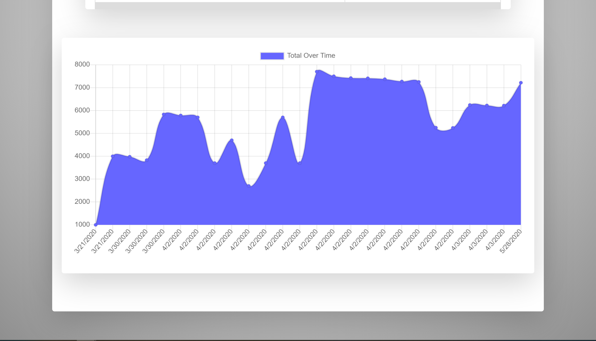

# Budget Tracker

Full Stack Application that lets you track your deposits and spending, whether you are online or offline.
This application also utilizes webpack and service worker to work as a progressive web application.

## [Try it yourself!](https://progressive-budget-tracker.herokuapp.com/)

### Home Page

## Getting Started

Navigate to the url  https://progressive-budget-tracker.herokuapp.com/ and type in the name of the transaction and then type in an amount in the transaction amount box. once you have completed that step click on add funds or subtract frunds depending on if it is a deposit or withdrawal.

## Built With

* [CSS](https://developer.mozilla.org/en-US/docs/Web/CSS) - Front-End style library
* [JavaScript](https://developer.mozilla.org/en-US/docs/Web/javascript) - High level programming language
* [MongoDB](https://www.mongodb.com/) - NoSQL Database
* [Express.js](https://expressjs.com/) - Node.js framework 
* [Node.js](https://nodejs.org/en/) - JavaScript runtime
* [IndexedDB](https://developer.mozilla.org/en-US/docs/Web/API/IndexedDB_API) - low-level API for client-side storage of significant amounts of structured data

## Authors
[contributors] Jacob Dolph 

